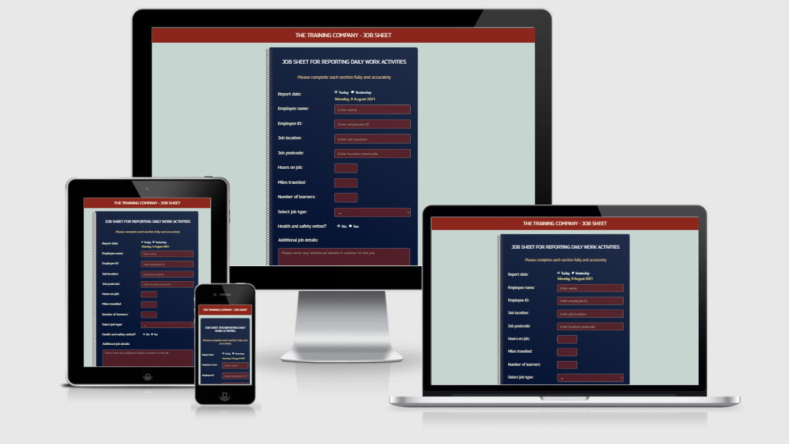
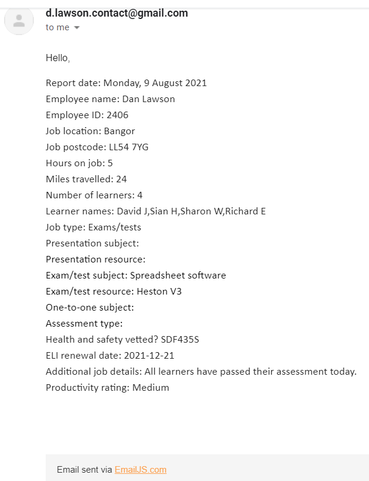
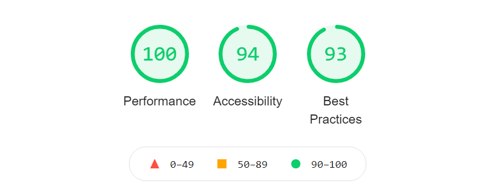
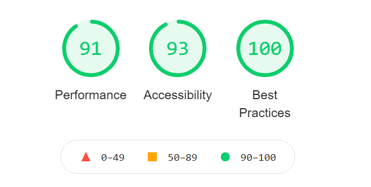
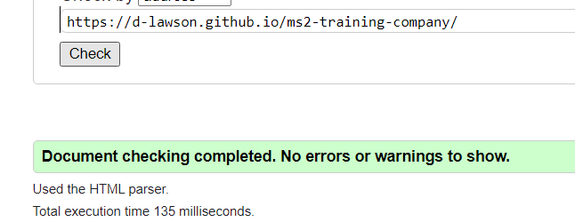
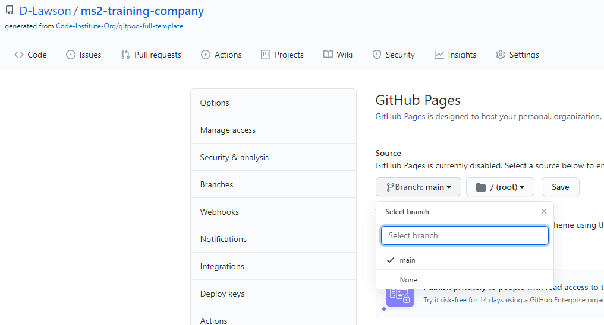
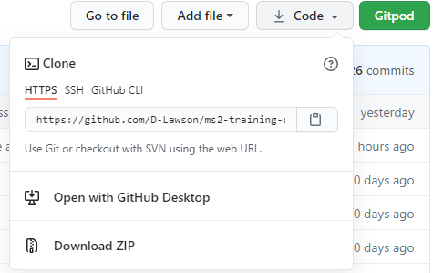

URL to the current deployed website:  [The Training Company](https://d-lawson.github.io/ms2-training-company/)

# The Training Company - Job sheet app

This application is intended to capture field data for a national training company.   The application will serve as a means of capturing and submitting employee shift data at the end of their shift.   As employees will be completing these forms regularly, it needs to be intuitive and user friendly.  As there are a few different variables associated with different shifts, the form will need to behave dynamically and respond to user input in an interactive way to make the experience as seamless as possible. 

The goal is to provide the employee managers with accurate and timely data at the end of each shift.  This will not only supply the company with useful HR information, but also information relating to the activities delivered by the company on a daily basis.

----

# UX
## Who is the audience?

The audience are employees of the company, in particular trainers, tutors, assessors.  At the end of each shift, employees are required to submit their shift data to their manager to record various details in relation to their shift (such as hours, miles travelled, nature of work activities and associated data).

## The site owner

The owner seeks to obtain accurate and timely data relating to the activities of employees on a daily basis.  This data will be used to manage and monitor staff activity, HR purposes and also monitor the activities devlivered by the company.  

## Typical user stories to expect:

1.  As a tutor I want to be able to quickly send my manager the details of today's one-to-one tutoring sessions I delivered with learners, along with shift hours and miles travelled for my mileage claim.

1.  As a trainer I want to be able to quickly send my manager details of the presentation I delivered to students today, along with shift hours and miles travelled for my mileage claim.

1.  As an assessor I want to be able to quickly send details of learners assessed on a site visit today and for which qualifications, along with shift hours and miles travelled for my mileage claim. 

1.  As an employee of the company I want to report today's activities and also supply information relating to a health and safety vetting carried out on site.

## The Strategy Plane

This application needs to make the process of submitting data as easy and efficient as possible.  As a routine activity that staff will undertake it must be very easy to use, intuitive and interactive to the point that the form adapts dynamically based on user inputs to speed up the process, and also avoid presenting the user with any unrequired inputs.   The form will need to ensure that data is accurate and that sufficient data has been submitted to meet requirements.  

Website user objectives:

* Document and submit HR data relating to shift (hours on job and miles travelled)
* Document and submit details of work activities, details of learners seen and the nature of activties delivered 
* Document and submit details of health and safety requirements
* Document and submit any additional details relevant to the job undertaken

Website owner objectives: 

* Provide employees with an efficient way to capture and submit information at the end of their shift
* Receive accurate and timely information relating to employee work activity and company activities
* Collect mileage information for expenses claims
* Improve effectiveness of systems for capturing and recording information
* Improve employee productivity

## The Scope Plane

These features are to be included as priorities:

*	Navigation bar across the top with basic brand information
*	Dynamic form that responds interactively to user inputs.  The form will contain the following features:
    *	Date selector (selecting 'today' or 'yesterday', generates the associated date)
    *	Text fields for employee name, employee ID, job location, job postcode
    *	Number fields for hours on job, miles travelled, number of learners (form to dynamically generate text input fields for learner names, dependent on the number of learners)
    *	Job type drop down selector (form to generate unique sections conditional on the job type)
    *	Health and safety section to be rendered into the form upon radio button 'yes'
    *	Section for supplying additional information relevant to the work activity
*	Application to determine a productivity score/rating based on hours on job, miles travelled and number of learners
*	Form to submit form data to the site owner via Email API

## The Structure Plane

The page will contain a standard navigation bar that will feature some basic brand information.  The page will provide instant access to the data capture form, which will feature prominently in the centre of the page.   The structure of the form will adhere to the data requirements outlined, with the form structure changing dynamically in response to user inputs.

## The Skeleton Plane

Here are the initial wireframes produced for this project:

[Landing page - desktop and tablets](assets/wireframes/wireframe-for-desktop.png)

[Landing page - mobile](assets/wireframes/wireframe-for-mobile.png)

## The Surface Plane 

Here are some of the styling rules that has been defined to date: 

### Fonts/typography

**Georama regular 400** from Google Fonts has been identified as suitable for form labels and headings throughout this project.   

### Colours

*	rgba(35, 47, 73) has been identified as a suitable base color for the theme
*	rgb(139,38,29) has been identified as suitable for the nav bar and footer
*	rgb(242,242,214) has been identified as suitable for form labels
*	rgb(228,195,133) has been identified as suitable for the form heading
*	rgb(139,38,29) has been identified as suitable for form input fill color

### Buttons

Generic bootstrap buttons have been deemed suitable, providing that the styling is overridden to complement the theme.

----

# Features

## Existing Features

*	Basic nav bar displaying the company  name and nature of the application
*	Form container placed prominently in the centre of the page for immediate access to the form.  A graphical element is placed on the left hand side of the container.
*   Form contains a radio button for reporting the date with options Today or Yesterday.  The application then utilises a JQuery event listener to render the calculated date into a span element within the form.
*   The form contains a range of input fields to obtain all the information specified (text, number, radio, date).  Also utilises Select and Textarea inputs.  
*   Upon entering Hours, Miles and Number of learners the application utilises JavaScript to calculate a productivity score using a specific formula.  This is then converted to a rating of Low, Medium or High which is then rendered into the form as feedback.
*   Upon selecting the Number of Learners, the application renders the associated amount of input fields to enter learner names.  Each name is assigned an unique Name and ID.  These names are then captured and placed into an array.
*   The 'Select job type' select element obtains a list of job types which is rendered into the element using JavaScript.  The chosen option then calls on the appropriate function to render the associated HTML into the container below.
*   The 'Health and safety vetted?' radio button Yes selection calls upon a function to render the associated HTML into the container below.
*   A textarea input field is displayed to allow the user to provide any additional information of use.
*   The form is validated using the native HTML5 validation which supplies sufficient feedback to the user to provide suffient and valid data.  The Postcode field contains a pattern to validate a UK postcode with required attributes placed where needed.
*   Upon successful validation the Submit button calls upon the relevant function to compile the form data and associate them with properties for the EmailJS API template.  The form is then submitted to the API and the data is sent to the assigned email address.  The submit function also initiates the modal popup to confirm successful submission, which then resets the form.
*   Basic footer is provided for application information and contact details.
*   The application contains adequate accessibility features for its purpose.

## Features Left to Implement

*   Information (i) icon to be placed next to 'report date' label with hover popover which instructs the user the reason why reports can only be created for Today and Yesterday (to encourage timeliness of reports), and to contact the administrator if the window has been missed.  (i) to be placed next to postcode label to instruct of the expected postcode format.

*   Generate JSON file containing form data upon submit.
*   Order form labels and inputs vertically in mobile view to enhance the mobile experience.

----

# Technologies Used

*   GitHub was used to host my repository and deploy the website onto Github Pages. GitPod was used as a workspace to develop the application.
*   Google Chrome was used as my primary browser for the development, including Dev Tools and Lighthouse. I used chrome on android mobile to aid development of responsiveness.
*   Bootstrap version 4.6 used for the grid system, nav, some styling and a button.
*   Languages used for this application were HTML, CSS and JavaScript.
*   JQuery libary version 3.6 was used so that I can utilise JQuery for some features
*   Google Fonts to import font styles into the CSS. The CSS2 API was used.
*   Balsamiq wireframes was used to produce the wireframes.
*   Adobe Illustrator was used to manipulate a vector graphic obtained from shutterstock
*   A11Y was used to test colour contrasts for sufficient accessibility.
*   TinyPNG was used to compress images.
*   The W3C validation tools were used to validate HTML and CSS
*   The JSHint tool was used to check for quality issues within the JavaScript
*   Favicon website was used to generate and embed the favicons.

----

# Testing

## Testing against user stories:

1.  As a tutor I want to be able to quickly send my manager the details of today's one-to-one tutoring sessions I delivered with learners, along with shift hours and miles travelled for my mileage claim.

    *	The form allows easy and intuitive input of hours and also miles travelled.  The form has an unique section for one-to-one sessions in order for the tutor to select the type and supply details without getting distracted by unnecessary elements.  The orm also provides the opportunity to provide additional information.  Name fields are generated in order to add the names of all learners.

1.  As a trainer I want to be able to quickly send my manager details of the presentation I delivered to students today, along with shift hours and miles travelled for my mileage claim.

    *	The form allows easy and intuitive input of hours and also miles travelled.  Details of the nature of the presentation can be entered upon selecting job type and additional information can be supplied if required.

1.  As an assessor I want to be able to quickly send details of learners assessed on a site visit today and for which qualifications, along with shift hours and miles travelled for my mileage claim.  Fields are generated for the assessor to supply the names of all those who were assessed.

    *	The subject details can be supplied when selecting the job type and providing details of the subject qualification.   Being able to provide details of hours and miles is necessary for all users.  Additional information can be supplied in the additional details section.

1.  As an employee of the company I want to report today's activities and also supply information relating to a health and safety vetting carried out on site.

    *	There is a designated section for providing the vetting reference number and the date which the ELI is due for renewal.   

## Manual testing procedures

Here are each of the steps that I took to test the application:

### Website Tested on different browsers at different screen widths for responsiveness – Chrome, Chrome for Android, Samsung Internet, Edge, Firefox

Firstly I tested the application on the desktop browsers chrome, edge and firefox. I tested the responsiveenss on each of these browsers by adjusting the width and zoom of the windows, again with a consistent positive result.   Secondly I used chrome devtoools to adjust the width and zoom manually using the tool, again to see a positive response at desktop and mobile widths.  I then tested the forms on chrome for Android and Samsung Internet on my phone, with nothing unexpected occurring.  Overall I am satisfied that the form functions as expected on these various browsers and devices.

### Testing form interactivity and overall functionality

I submitted fully completed forms to the EmailJS API using all the different combinations of input selections.  I was able to get the same sucessful result with each combination successfully submitting to the email API, regardless of the combinations selected.   The form validation works as intended as I did try to enter invalid data into the postcode field, also leave fields blank to test the required attribute.  All combinations of inputs are received by the associated email account as demonstrated below.

### Test with Chrome Devtools Lighthouse

The lighthouse report turned out favourably for both desktop and mobile devices.  I did not make use of the SEO tool for this application since it's an in-house product for an organisation.   The only notable warnings that came up for performance were associated with external library dependency (boostrap and jquery).

- Desktop

- Mobile

There was an issue in relation to accessibility that lightroom pointed out that I am yet to fix.  One of the labels for the H&S radio button is not 'correctly announced' and I believe this to be associated with the ID, of which when I changed to match the other button ID the tool would throw out an ARIA related issue then because the two ID's were the same.  I'll put this down as a known bug but I'm satisfied with the overall accessibility score.  

###	W3 HTML Validation tool

The site passed this validation tool without any errors.   The only caution present was associated with the comments which stated 'The document is not mappable to XML 1.0 due to two consecutive hyphens in a comment'.  I therefore corrected the hyphens in my commenting and the tool passed with no errors or warnings.

###	W3 CSS Validation tool

This tool came out with 2 errors resulting from the bootstrap library and of which there were no dependencies on those classes.  The tool also showed warnings from the bootstrap library.  No errors or warnings were reported from my CSS.

### The A11Y Color Contrast Accessibility Validator

This tool picked up one issue to do with the contrast of the radio button element (between blue and black).  This was not consistent with my observation on the page itself as the radio buttons and text were in fact light.  

### JSHint JavaScript quality checker

This tool did not show up any errors.  It highlighted some warnings that appear to be related to the use of const and also template literals.  After a bit of research these do not appear to be significant in the context of this application. 

## Other testing considerations/Known bugs

As identified during the lightroom accessibility check there appears to be an issue with the ID's of the radio buttons when it comes to accessibility features.  In this instance it has no affect on the functionality of the application however this may need to be looked at further if using a standard POST method in future as opposed to relying on EmailJS.  

----

# Deployment

I decided to deploy this application on GitHub pages.  Here were the steps taken to publish it:

Access the settings tab on GitHub, click on the Pages section.  Select main branch for the ms2-training-company repository.  Click on save. This was all that was required in order to publish the page to [The Training Company](https://d-lawson.github.io/ms2-training-company/)

## Deploying the repository locally

In order to deploy the repository yourself and run new instances of it there is an additional process which I will explain below.

GitHub offers anyone the opportunity to clone a repository.  This can be done by accessing the 'Code' button on the main repository page and viewing the options there.  

The first option is to clone by HTTPS.  It's possible to click the copy button next to it to copy the URL to your clipboard.  Frome your desired workspace you will need to open a terminal and load a suitable directory to store the repository.  From there you can use the command 'git clone' along with the URL to sucessfully clone the repository.   

It is also possible to clone to GitHub desktop from the 'Code' menu.  If you have the Git Hub Desktop application installed on your desktop you can expect to be guided through the process of deploying it locally onto your instance of Git Hub desktop.

Alternatively, from the 'code' menu it is possible to download all the files in a .zip folder where you will be able to transfer the files to any workspace or hosting platform of your choosing.   

In order to sucessfully get the website up and running it will be necessary to obtain your own Email JS API key and replace the existing API key that is stored within the HTML head under EmailJS.  It will allso be necessary to obtain your own service code and also template code and insert them into the sendMail function in the script.js file (replacing the existing values).

----

# Credits

## Content

Use of external content has been limited due to the nature of the project.

## Media

Images acquired from:

[Presentation graphic](https://pngtree.com/freepng/presentation-glyph-black-icon_4008228.html)

[Spiral vector for the form](https://www.shutterstock.com/image-vector/spiral-notebook-722536987)

[One-to-one graphic](https://www.pngarea.com/view/0f17f679_benefits-icon-png-benefit-counseling-pierce-benefits-transparent/)

[Paper and pencil graphic](https://pngtree.com/freepng/vector-documentation-icon_4013897.html)

Favicon website was used to generate the browser icon.

## Acknowledgements 

* Code Institute's LMS provided me with a great foundation to the way I have approached this project. I made use of teachings from UX to coding.
* My mentor Guido Cecilio for providing me with feedback and making me aware of conventions and best practice. Also for supporting me with rendering the list options from script into the HTML select input.  Guido also assisted me in correcting behaviour of the footer positioning which was behaving unexpectedly as a result of the position setting of other elements.   
* General Bootstrap documentation for classes and their behaviour
* General JQuery documentation on its features and functions
* StackOverflow discussions were useful in how to approach the addFields function to insert and remove table cells.  Also used for ideas with displaying the date.
* EmailJS documentation in order to understand how to implement the API.
